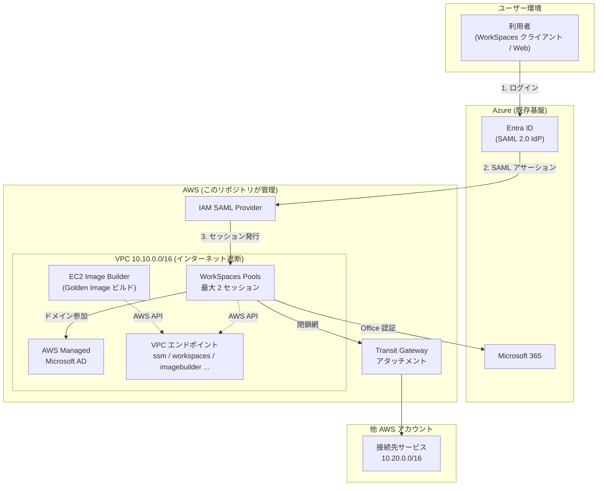
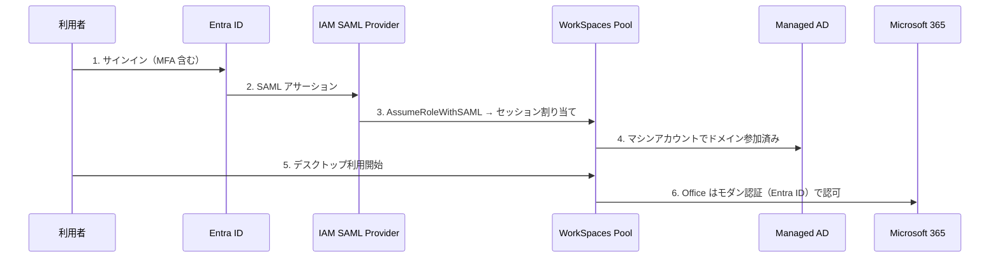
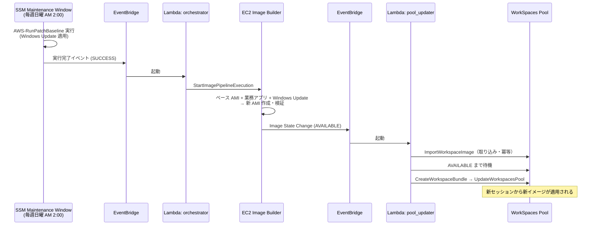
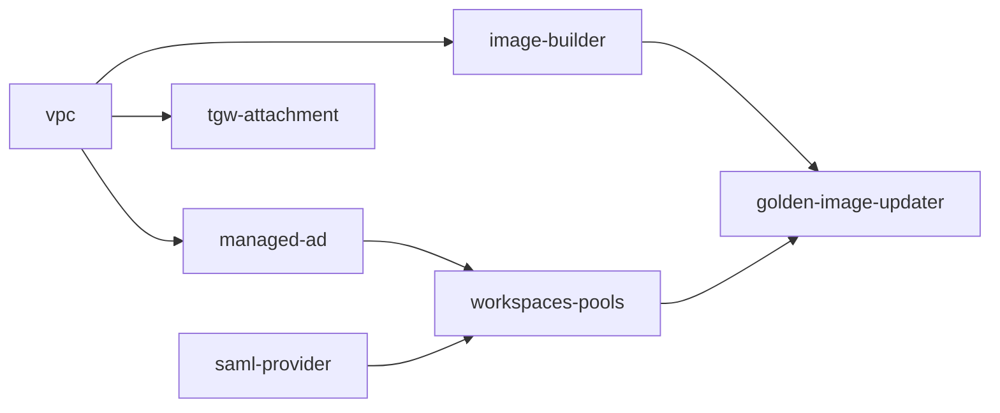

# アーキテクチャ

AWS WorkSpaces Pools による VDI 基盤。Entra ID 認証・閉鎖網接続・Golden Image 自動更新を Terragrunt で管理する。

## 要件と実現方式の対応

| 要件 | 実現方式 | ユニット |
|---|---|---|
| VDI | WorkSpaces Pools（セッションベース） | `workspaces-pools` |
| 同時利用は最大 2 名 | Pool capacity = 2 セッション | `workspaces-pools` |
| ログインは Entra ID 経由 | SAML 2.0 フェデレーション | `saml-provider` |
| Office 認証（Active Directory） | AWS Managed Microsoft AD にドメイン参加 | `managed-ad` |
| 別サービスへ閉鎖網で接続 | Transit Gateway（他アカウント所有・RAM 共有） | `tgw-attachment` |
| インターネット遮断 | VPC エンドポイントのみで AWS API に到達 | `vpc` |
| Windows Update 検知 → Golden Image 自動更新 | SSM Patch → EventBridge → Image Builder → Pool 更新 | `ssm-patch` / `image-builder` / `golden-image-updater` |

## 全体構成

## 認証フロー

- 人の認証は **Entra ID が単一の入口**（MFA・条件付きアクセスは Azure 側で管理）
- Managed AD は **マシン認証・GPO 用**。ユーザー ID の複製は Entra ID Connect のハイブリッド構成に依存
- SAML メタデータ XML は gitignore 対象。取得・配置手順は `catalog/units/saml-provider/entra-id-metadata.xml` のプレースホルダー内コメントに記載

## Golden Image 自動更新フロー

- 更新は**完全自動**（人間の承認ゲートなし）。承認制にする場合は L1 の前に SNS + 手動承認ステップを挿入する
- AMI は直接 Pool に適用できないため、**Image 取り込み → Bundle 作成**の 2 段を Lambda が冪等に実行する。取り込みが Lambda の 15 分を超える場合は EventBridge の非同期リトライ（最大 2 回）で続きから再開。それでも足りない環境は Step Functions 化を検討
- パッチ判定基準: Critical/Security は 7 日後自動承認、その他 Updates は 14 日後（`ssm-patch` の Patch Baseline）
- `workspaces-pools` の `lifecycle.ignore_changes = [bundle_id]` により、Lambda による画像更新を Terraform が巻き戻さない

## ネットワーク設計

| 項目 | 設計 |
|---|---|
| VPC CIDR | `10.10.0.0/16`（`stack_vars.hcl` で変更可） |
| サブネット | プライベート × 2 AZ のみ。パブリックサブネット・IGW・NAT なし |
| AWS API 到達 | Interface 型 VPC エンドポイント（ssm / ssmmessages / ec2messages / workspaces / imagebuilder / lambda / events）+ S3 Gateway 型 |
| 他アカウント接続 | Transit Gateway アタッチメント。TGW 本体は他アカウント所有・RAM 共有（`data` 参照） |
| セキュリティグループ | WorkSpaces → AD は LDAP/LDAPS/DNS のみ、他アカウント向けは指定 CIDR のみ許可 |

## ユニット依存グラフ

依存の解決は `catalog/stacks/vdi-core/terragrunt.stack.hcl` が担う。環境パラメータは `live/<env>/<region>/vdi/stack_vars.hcl` に集約。

## セッションポリシー

| 設定 | 値 | 根拠 |
|---|---|---|
| 同時セッション上限 | 2 | 要件。Pool の確保容量そのもの |
| アイドル切断 | 30 分 | 放置セッションの容量占有を防ぐ |
| 切断後のセッション保持 | 1 時間 | 誤切断からの復帰猶予 |
| 最大連続利用 | 8 時間 | 1 営業日でセッションを強制リセット |

## 運用ガードレール

- `terraform apply` は**人間のみ**が実行する。AI エージェントは plan まで（`CLAUDE.md` + `.claude/settings.json` で二重に強制）
- 検証は `make check`（fmt / validate / tflint / trivy）。CI と同一コマンド
- AD 管理者パスワードは Secrets Manager 参照のみ。SAML メタデータはリポジトリ外管理

## 未設定・引き継ぎ事項

| 項目 | 場所 | 状態 |
|---|---|---|
| Transit Gateway ID | `live/prod/ap-northeast-1/vdi/stack_vars.hcl` | プレースホルダー（他アカウント管理者に確認） |
| WorkSpaces Bundle ID | 同上 | プレースホルダー（コンソールで利用可能 ID を確認） |
| Entra ID メタデータ XML | `catalog/units/saml-provider/` | プレースホルダー（Azure Portal から取得） |
| AD 管理者パスワード | Secrets Manager | 事前作成が必要 |
| CI の plan ジョブ | GitHub Variables `AWS_ROLE_ARN` | 未設定（OIDC ロール作成後に有効化） |
