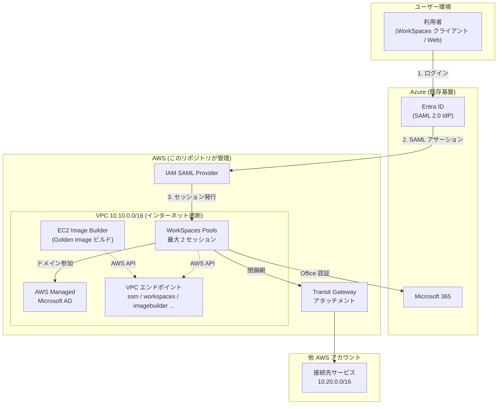
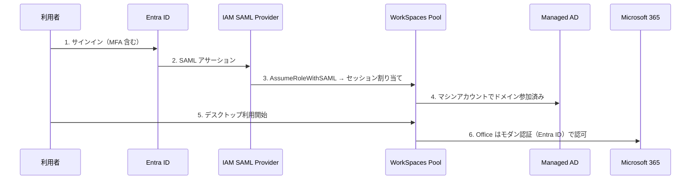
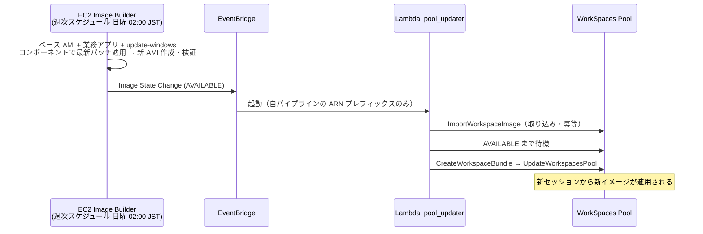
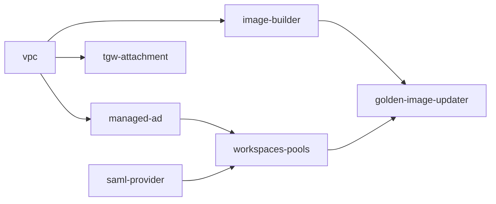

# アーキテクチャ

AWS WorkSpaces Pools による VDI 基盤。Entra ID 認証・閉鎖網接続・Golden Image 自動更新を Terragrunt で管理する。

## 要件と実現方式の対応

| 要件 | 実現方式 | ユニット |
|---|---|---|
| VDI | WorkSpaces Pools（セッションベース） | `workspaces-pools` |
| 同時利用は最大 2 名 | Pool capacity = 2 セッション | `workspaces-pools` |
| ログインは Entra ID 経由 | SAML 2.0 フェデレーション | `saml-provider` |
| Office 認証（Active Directory） | AWS Managed Microsoft AD にドメイン参加 | `managed-ad` |
| 別サービスへ閉鎖網で接続 | Transit Gateway（他アカウント所有・RAM 共有） | `tgw-attachment` |
| インターネット遮断 | VPC エンドポイントのみで AWS API に到達 | `vpc` |
| Windows Update → Golden Image 自動更新 | Image Builder 週次スケジュール（update-windows コンポーネント）→ EventBridge → Pool 更新 | `image-builder` / `golden-image-updater` |

## 全体構成

## 認証フロー

- 人の認証は **Entra ID が単一の入口**（MFA・条件付きアクセスは Azure 側で管理）
- Managed AD は **マシン認証・GPO 用**。ユーザー ID の複製は Entra ID Connect のハイブリッド構成に依存
- SAML メタデータ XML は gitignore 対象。取得・配置手順は `catalog/units/saml-provider/entra-id-metadata.xml` のプレースホルダー内コメントに記載

## Golden Image 自動更新フロー

- 更新は**完全自動**（人間の承認ゲートなし）。承認制にする場合は pool_updater の前に SNS + 手動承認ステップを挿入する
- Windows Update の適用は Image Builder レシピ内の **update-windows コンポーネント**が担う。旧設計（SSM Maintenance Window でパッチ→検知）はターゲットとなる常駐インスタンスが存在せず機能していなかったため、パイプラインのネイティブ週次スケジュールに簡素化した（review-log #4-1）
- AMI は直接 Pool に適用できないため、**Image 取り込み → Bundle 作成**の 2 段を Lambda が冪等に実行する。取り込みが Lambda の 15 分を超える場合は EventBridge の非同期リトライ（最大 2 回）で続きから再開。それでも足りない環境は Step Functions 化を検討
- `workspaces-pools` の `lifecycle.ignore_changes = [bundle_id]` により、Lambda による画像更新を Terraform が巻き戻さない
- **レシピ変更時の注意**: Image Builder のレシピは immutable。コンポーネントや parent_image を変更したら `version` を必ず上げる（上げないと apply が失敗する）
- **失敗時の最終防衛**: pool_updater には DLQ（SQS・14 日保持）と CloudWatch アラーム 2 本（Lambda Errors / DLQ 滞留 → SNS `vdi-golden-image-alerts`）が付いている。リトライを使い切ったイベントは DLQ に保全され、[runbook.md](runbook.md) の手順で冪等に再実行できる

## ネットワーク設計

| 項目 | 設計 |
|---|---|
| VPC CIDR | `10.10.0.0/16`（`stack_vars.hcl` で変更可） |
| サブネット | プライベート × 2 AZ のみ。パブリックサブネット・IGW・NAT なし |
| AWS API 到達 | Interface 型 VPC エンドポイント（ssm / ssmmessages / ec2messages / workspaces / imagebuilder / lambda / events）+ S3 Gateway 型 |
| 他アカウント接続 | Transit Gateway アタッチメント。TGW 本体は他アカウント所有・RAM 共有（`data` 参照） |
| セキュリティグループ | WorkSpaces → AD は AD 必須ポートセット（DNS / Kerberos / NTP / RPC + 動的レンジ / SMB / LDAP / LDAPS / GC の 13 種、`vpc/main.tf` の `local.ad_ports` に用途コメント付きで定義）、他アカウント向けは指定 CIDR × 指定ポートのみ、ビルドインスタンスは専用 SG（VPC エンドポイント + S3 prefix list のみ） |

## ユニット依存グラフ

依存の解決は `catalog/stacks/vdi-core/terragrunt.stack.hcl` が担う。環境パラメータは `live/<env>/<region>/vdi/stack_vars.hcl` に集約。

## セッションポリシー

| 設定 | 値 | 根拠 |
|---|---|---|
| 同時セッション上限 | 2 | 要件。Pool の確保容量そのもの |
| アイドル切断 | 30 分 | 放置セッションの容量占有を防ぐ |
| 切断後のセッション保持 | 1 時間 | 誤切断からの復帰猶予 |
| 最大連続利用 | 8 時間 | 1 営業日でセッションを強制リセット |

## 運用ガードレール

- `terraform apply` は**人間のみ**が実行する。AI エージェントは plan まで（`CLAUDE.md` + `.claude/settings.json` で二重に強制）
- 検証は `make check`（fmt / validate / tflint / trivy）。CI と同一コマンド
- AD 管理者パスワードは Secrets Manager 参照のみ。SAML メタデータはリポジトリ外管理
- 障害対応・ロールバック・棚卸しは [runbook.md](runbook.md) 参照

## 未設定・引き継ぎ事項

| 項目 | 場所 | 状態 |
|---|---|---|
| Transit Gateway ID | `live/prod/ap-northeast-1/vdi/stack_vars.hcl` | プレースホルダー（他アカウント管理者に確認） |
| WorkSpaces Bundle ID | 同上 | プレースホルダー（コンソールで確認。**初回構築時のみ使用**、以後は自動更新が置換） |
| アラート通知先 `alert_email` | 同上 | 未設定（**空のままだとアラームが誰にも届かない**） |
| WorkSpaces ディレクトリ登録型 | `workspaces-pools` ユニット | **要検証**: `aws_workspaces_directory` が PERSONAL 型で登録され、Pools には POOLS 型が必要な可能性（review-log #8-2）。AWS 認証環境での plan / 実機確認が必要 |
| update-windows の到達性 | `image-builder` レシピ | **要検証**: 閉鎖網でビルドインスタンスが Windows Update に到達できるか（review-log #9-1 参照） |
| Entra ID メタデータ XML | `catalog/units/saml-provider/` | プレースホルダー（Azure Portal から取得） |
| AD 管理者パスワード | Secrets Manager | 事前作成が必要 |
| CI の plan ジョブ | GitHub Variables `AWS_ROLE_ARN` | 未設定（OIDC ロール作成後に有効化） |
